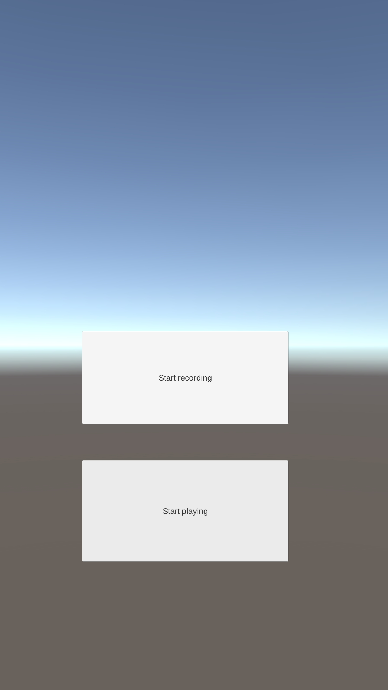

# unity3d_audio

Sample of using audio (recording, playing wav files) in Unity3D.

Used objects:  WWW, AudioClip en AudioSource

Features:

- 2 buttons, for recording and playing audio

- Record audio using events OnPointerUp, stop recording at clicking OnPointerUp again 

- Record audio in wav format, store in wav file (test.wav) on local file storage (Application.persistentDataPath)

- Android support tested

